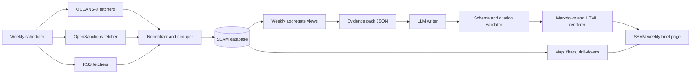
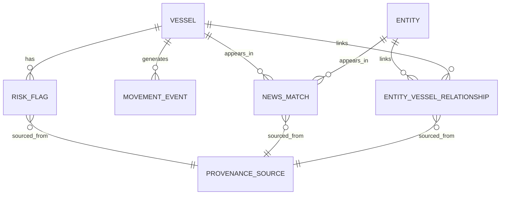

# Designing an Agentic Weekly Brief for SEAM

## Executive summary

SEAM should not give an LLM direct, open-ended access to your whole database or all available OCEANS-X data. The stronger design is a **bounded workflow**: deterministic data fetch and normalization first, deterministic aggregation second, then a constrained model that writes from a compact evidence pack and is forced to return strict structured output. That approach fits the way OCEANS-X is positioned by MPA as a secure **system-to-system** exchange platform for trusted maritime data, and it also fits model-vendor guidance on structured outputs, prompt caching, and hallucination reduction. MPA says OCEANS-X already hosts **over 100 APIs and datasets** and explicitly welcomes analytics and AI-enabled tools; your uploaded endpoint inventory alone lists **60 tested working endpoints**, which is already too broad for direct model access. fileciteturn0file0 citeturn31view0turn23view0turn25view0

For analyst value, the weekly brief should focus on **changes**, not raw volume: new or resolved risk flags, detention changes, linked-entity changes, important arrivals and departures, and matched adverse news. It should support triage and monitoring, not judgment. That distinction matters because OFAC’s own sanctions search tool says it uses **approximate string matching** and is **not a substitute for due diligence**, while OpenSanctions documents scored fuzzy matching and confidence thresholds rather than legal conclusions. SEAM should therefore present **sourced facts** such as “matched to a sanctions-related source record” or “linked to a detention record,” and avoid language such as “illicit,” “evasive,” or “non-compliant” unless the source itself says that. citeturn13search3turn28view0turn25view0

Most of your existing data is useful, but **not for the same purpose**. A small core belongs in the weekly narrative prompt: grouped risk by vessel, risk severity and status, linked entities and roles, unique vessel counts per entity, news title/source/date/original URL, key vessel particulars, movements, arrivals and departures, and evidence timestamps. A much larger set should stay out of the model prompt and remain in the app or database only: static GIS layers, code lookup tables, raw payloads, hashes, ingestion logs, table counts, and front-end state. That is how you keep cost low and outputs auditable. fileciteturn0file0 citeturn28view0turn23view2turn23view4

A final strategic point: your current data is good for a first version, but a sanctions-aware maritime brief for oil and gas analysts is still missing some high-value signals that OFAC specifically highlights, including **AIS manipulation or gaps, repeated ship-to-ship transfers, frequent flag changes, complex ownership changes, and cargo-origin verification signals**. SEAM should not pretend to cover those until you explicitly track them. citeturn36view0

## Recommended architecture

The right “agentic” design for SEAM is **not** a free-roaming agent that browses every endpoint and invents a story. It is a small set of **bounded agents or agent-like stages** with narrow permissions:

| Stage | Best implemented as | Why |
|---|---|---|
| Fetch OCEANS-X data | Deterministic scheduled code | Stable, repeatable, cheap |
| Fetch OpenSanctions data | Deterministic scheduled/on-demand code | Needs tight thresholds, rate control, and schema normalization |
| Fetch RSS items | Deterministic scheduled code | Simple polling; no LLM value here |
| Build weekly facts | SQL/materialized views/business rules | Numbers should be computed, not guessed |
| Write summary text | LLM | Good at compression and plain-language phrasing |
| Validate sources/schema | Deterministic validator, with optional one-pass repair | Keeps unsupported claims out |

This architecture fits the sources. OCEANS-X is designed for trusted machine-to-machine exchange; OpenSanctions warns that response structures are dynamic and that search/match responses can be large; OpenAI recommends strict structured outputs when schema adherence matters; Anthropic recommends explicit success criteria, evaluations, and source-grounded anti-hallucination safeguards. citeturn31view0turn28view0turn23view0turn23view1turn24view2turn25view0

A sensible **source-priority order** for SEAM is:

| Priority | Source tier | Examples | Use in SEAM |
|---|---|---|---|
| Highest | Official operational data | OCEANS-X / MPA | Positions, movements, arrivals, departures, particulars |
| High | Official sanctions/watchlist graph data | OpenSanctions plus source URLs/IDs | Risk flags, source provenance, entity relationships |
| High | Official institutional RSS | IMO RSS and similar official notices | Regulatory and public maritime developments |
| Medium | Reputable trade RSS | JOC, MarineLink, The Maritime Executive | Adverse news and context |
| Lowest | Internal operational metadata | Ingestion jobs, logs, table counts | Admin view only, never narrative |

Official RSS feeds are publicly available from IMO, and trade feeds are available from JOC and MarineLink; The Maritime Executive also exposes an RSS feed endpoint. That mix supports the report well, but official machine data should always outrank trade-press context when the two conflict. citeturn16search3turn16search2turn17search0turn17search1turn17search2



The most important architectural rule is simple: **the LLM should see a compact fact pack, not raw source systems**. That keeps the model in a writing role, not an inference role. citeturn23view0turn25view0

## Data inventory and prioritization

The uploaded endpoint inventory is already enough to make a sharp cut. By a practical implementation classification, your 60 tested OCEANS-X endpoints break into roughly **26 vessel/operations feeds, 11 reference feeds, and 23 GIS/static layers**. For a weekly narrative product, that means the majority of endpoints should **never** go into the prompt. They can still be valuable in the app. fileciteturn0file0

The status labels below mean:

- **Essential**: should feed the weekly fact pack or its derived metrics.
- **Optional**: useful for drill-downs, special cases, or UI detail.
- **Discard from weekly narrative prompt**: keep in DB/app only.

The OCEANS-X inventory below is derived from your uploaded file. fileciteturn0file0

| ID | OCEANS-X endpoint | Type | Status |
|---|---|---:|---|
| 2 | Vessel Positions Snapshot | Array&lt;position&gt; | Essential |
| 8 | Vessel Movements by CallSign | Array&lt;movement&gt; | Optional |
| 12 | Vessel Positions by Name | Array&lt;position&gt; | Optional |
| 15 | Vessel Particulars by IMO Number | Object&lt;particulars&gt; | Essential |
| 16 | Vessels Due to Arrive by Date | Array&lt;schedule&gt; | Essential |
| 19 | Vessel Particulars by Name | Object&lt;particulars&gt; | Optional |
| 24 | Vessel Movements by Name | Array&lt;movement&gt; | Optional |
| 26 | Vessel Movements by IMO Number | Array&lt;movement&gt; | Essential |
| 27 | Vessel Arrival Declaration by IMO Number | Array&lt;arrival declaration&gt; | Optional |
| 28 | Port Clearance Cert by CallSign | Object/Array&lt;clearance&gt; | Optional |
| 29 | Last Vessel Arrival Declaration by Vessel Name | Object&lt;arrival declaration&gt; | Optional |
| 31 | Vessel Positions by CallSign | Array&lt;position&gt; | Optional |
| 33 | SRS Certificate by Vessel Details | Array&lt;certificate&gt; | Optional |
| 41 | Vessel Arrival Declaration by Date | Array&lt;arrival declaration&gt; | Optional |
| 42 | List of Vessel Particulars by Name | Array&lt;particulars&gt; | Optional |
| 54 | Vessel Arrival Declaration by Vessel Name | Array&lt;arrival declaration&gt; | Optional |
| 57 | Port Clearance Cert by IMO Number | Object/Array&lt;clearance&gt; | Optional |
| 63 | Vessel Arrival Declaration by CallSign | Array&lt;arrival declaration&gt; | Optional |
| 65 | Vessel Departure Declaration by IMO Number | Array&lt;departure declaration&gt; | Optional |
| 67 | Vessel Particulars by CallSign | Object&lt;particulars&gt; | Optional |
| 69 | Vessel Departure Declaration by CallSign | Array&lt;departure declaration&gt; | Optional |
| 72 | Port Clearance Cert by Vessel Name | Object/Array&lt;clearance&gt; | Optional |
| 77 | Vessel Arrivals by Date | Array&lt;arrival record&gt; | Essential |
| 80 | Vessels Due to Depart by Date | Array&lt;schedule&gt; | Essential |
| 84 | Vessel Departure Declaration by Date | Array&lt;departure declaration&gt; | Optional |
| 85 | SRS Certificate by Certificate Number | Object&lt;certificate&gt; | Optional |

| ID | OCEANS-X endpoint | Type | Status |
|---|---|---:|---|
| 3 | DepthsA | ZIP GIS area | Discard from weekly narrative prompt |
| 4 | Country Codes CSV ZIP | ZIP reference | Discard from weekly narrative prompt |
| 7 | CoastlineL | ZIP GIS line | Discard from weekly narrative prompt |
| 10 | OffshoreInstallationsA | ZIP GIS area | Discard from weekly narrative prompt |
| 11 | DangersA | ZIP GIS area | Discard from weekly narrative prompt |
| 14 | PortsAndServicesA | ZIP GIS area | Discard from weekly narrative prompt |
| 18 | Vessel Type CSV ZIP | ZIP reference | Discard from weekly narrative prompt |
| 20 | Port Codes JSON | JSON reference | Discard from weekly narrative prompt |
| 21 | Country Codes JSON | JSON reference | Discard from weekly narrative prompt |
| 23 | Location Codes JSON ZIP | ZIP reference | Discard from weekly narrative prompt |
| 32 | CulturalFeaturesA | ZIP GIS area | Discard from weekly narrative prompt |
| 34 | NaturalFeaturesA | ZIP GIS area | Discard from weekly narrative prompt |
| 38 | PortsAndServicesP | ZIP GIS point | Discard from weekly narrative prompt |
| 43 | DangersP | ZIP GIS point | Discard from weekly narrative prompt |
| 45 | DangersL | ZIP GIS line | Discard from weekly narrative prompt |
| 47 | Master Plan 2019 SDCP Nature Boundary Layer | JSON GIS | Discard from weekly narrative prompt |
| 48 | OffshoreInstallationsL | ZIP GIS line | Discard from weekly narrative prompt |
| 49 | Location Codes JSON | JSON reference | Discard from weekly narrative prompt |
| 50 | Country Codes JSON ZIP | ZIP reference | Discard from weekly narrative prompt |
| 51 | PortsAndServicesL | ZIP GIS line | Discard from weekly narrative prompt |
| 52 | Port Codes JSON ZIP | ZIP reference | Discard from weekly narrative prompt |
| 53 | Port Codes CSV ZIP | ZIP reference | Discard from weekly narrative prompt |
| 55 | CoastlineA | ZIP GIS area | Discard from weekly narrative prompt |
| 60 | Master Plan 2019 SDCP Nature Boundary Line Layer | JSON GIS | Discard from weekly narrative prompt |
| 61 | Master Plan 2019 SDCP Park and Open Space Layer | JSON GIS | Discard from weekly narrative prompt |
| 64 | DepthsL | ZIP GIS line | Discard from weekly narrative prompt |
| 68 | CulturalFeaturesP | ZIP GIS point | Discard from weekly narrative prompt |
| 70 | NaturalFeaturesL | ZIP GIS line | Discard from weekly narrative prompt |
| 74 | NaturalFeaturesP | ZIP GIS point | Discard from weekly narrative prompt |
| 78 | CulturalFeaturesL | ZIP GIS line | Discard from weekly narrative prompt |
| 79 | Location Codes CSV ZIP | ZIP reference | Discard from weekly narrative prompt |
| 81 | MilitaryFeaturesA | ZIP GIS area | Discard from weekly narrative prompt |
| 82 | Vessel Type JSON ZIP | ZIP reference | Discard from weekly narrative prompt |
| 83 | AidsToNavigationP | ZIP GIS point | Discard from weekly narrative prompt |

The most efficient way to use those endpoints is to choose **canonical routes** and treat the rest as fallbacks. MPA describes OCEANS-X as direct integration infrastructure, and the repeated “by IMO / by CallSign / by Name” families in your inventory are exactly where you can cut cost and complexity. fileciteturn0file0 citeturn31view0

| Data family | Canonical endpoint | Fallbacks | Why |
|---|---|---|---|
| Positions | Vessel Positions Snapshot | Positions by CallSign / Name | Snapshot is the only broad batch feed |
| Particulars | Vessel Particulars by IMO Number | by CallSign / by Name / list by Name | IMO is the strongest stable vessel key |
| Movements | Vessel Movements by IMO Number | by CallSign / by Name | Canonical identity, lower ambiguity |
| Arrivals | Vessels Due to Arrive by Date + Vessel Arrivals by Date | arrival declarations by key | Date-based feeds are better for batch reporting |
| Departures | Vessels Due to Depart by Date | departure declarations by key/date | Gives a clean weekly operational view |
| Port clearance | Port Clearance Cert by IMO Number | by CallSign / by Name | Use only for drill-down or certificate context |
| Registry | SRS Certificate by Vessel Details | by Certificate Number | Singapore-specific detail, not default narrative |
| Location lookups | Port Codes JSON + Country Codes JSON + Location Codes JSON | ZIP/CSV variants | One canonical format is enough |
| Vessel types | Vessel Type JSON ZIP | CSV ZIP | Avoid duplicate lookup pipelines |

There is also a second inventory: the local DB fields from your prompt. Those fields are much closer to what the weekly brief actually needs. The table below interprets types conservatively; ambiguous items are marked **unspecified**.

**Risk and sanctions fields**

| Field | Type | Status | Notes |
|---|---|---:|---|
| Risk flags by vessel | record collection | Essential | Core grouping object |
| Sanctions matches | record collection | Essential | Core risk signal |
| Watchlist matches | record collection | Essential | Core risk signal |
| Detention records | record collection | Essential | Important maritime quality/risk signal |
| High-risk flag country matches | record collection | Optional | Better as detail/filter than headline |
| Identity conflict records | record collection | Essential | Data integrity and screening context |
| Adverse news mentions | record collection | Essential | Core narrative source |
| Risk severity | enum | Essential | You specified critical/high/medium/low |
| Risk status | enum | Essential | You specified active/open/resolved |
| Human-readable sanctions source list names | string[] | Essential | Best provenance label for UI |
| OpenSanctions evidence payloads | JSON | Optional | Keep for drill-down, not prompt body |
| OpenSanctions entity IDs | string[] | Essential | Stable source reference |
| OpenSanctions URLs | URL[] | Essential | Provenance drill-down |
| OpenSanctions countries | string[] | Optional | Filter/detail field |
| OpenSanctions topics | string[] | Optional | Filter/detail field |
| OpenSanctions datasets | string[] | Optional | Good for provenance and faceting |
| OpenSanctions aliases | string[] | Optional | Matching aid, not display text |
| Identity conflict fields and conflicting values | JSON | Optional | Good in detail drawer, not summary sentence |
| Grouped Risk & Sanctions feed by vessel | aggregated record collection | Essential | Best narrative-ready basis |

**News fields**

| Field | Type | Status | Notes |
|---|---|---:|---|
| RSS news articles | record collection | Essential | Ingest pool for narrative |
| News title | string | Essential | Always keep |
| News source | string | Essential | Always keep |
| News published date | datetime | Essential | Always keep |
| News snippet | text | Optional | Trim hard before prompt |
| News image | URL | Optional | UI only, not prompt |
| News original URL | URL | Essential | Provenance and click-through |
| RSS bundle/category | string | Optional | Classification/filter only |
| News source badges/logos | media asset | Discard from weekly narrative prompt | UI polish only |
| News-to-vessel/entity links when matched | relationship collection | Essential | Critical to relevance |

**Entity and relationship fields**

| Field | Type | Status | Notes |
|---|---|---:|---|
| Entity records | record collection | Essential | Core join layer |
| Company/owner/operator/manager names | string[] | Essential | Best screening inputs |
| Entity country code | string | Optional | Useful detail/filter |
| Entity external ID | string | Essential | Stable join key |
| Entity-to-vessel relationship records | record collection | Essential | Core graph layer |
| Unique vessel count per entity | integer | Essential | Strong summary metric |
| Relationship role | string/enum | Essential | Do not collapse owner/operator/manager together |
| Relationship confidence | unspecified | Optional | Better in detail than headline |
| Relationship evidence/source summaries | text[] | Essential | Use in provenance drawer |

**Evidence, operations, and UI fields**

| Field | Type | Status | Notes |
|---|---|---:|---|
| Source observations/evidence records | record collection | Optional | Drill-down only |
| Raw payload storage | JSON/blob | Discard from weekly narrative prompt | Audit/debug only |
| Payload hashes | hash/string | Discard from weekly narrative prompt | Dedupe only |
| Evidence timestamps | datetime[] | Essential | Freshness and chronology |
| Ingestion jobs | operational record | Discard from weekly narrative prompt | Admin only |
| Ingestion logs | operational record | Discard from weekly narrative prompt | Admin only |
| Source health status | enum/status | Optional | Good for stale-data banner |
| Table counts | integer metrics | Discard from weekly narrative prompt | Admin only |
| Operations timeline events | unspecified | Optional | Keep only if they are true maritime events; otherwise admin only |
| Map filters | UI state | Discard from weekly narrative prompt | Front-end only |
| Selected/multi-selected vessel state | UI state | Discard from weekly narrative prompt | Front-end only |
| Entity-focused vessel highlighting state | UI state | Discard from weekly narrative prompt | Front-end only |

A useful weekly maritime brief for oil and gas users also needs a few signals that are **not** in your current list. OFAC’s 2025 maritime advisory calls out ship-to-ship transfers, manipulated or missing AIS data, frequent flag changes, complex ownership structures, and cargo-origin verification as important risk indicators. PSC data matters too because IMO defines Port State Control as inspections that can result in delay or detention when ships do not meet required standards. citeturn36view0turn34view1turn34view0

| Missing or weakly represented signal | Why it matters | Recommendation |
|---|---|---|
| AIS gap windows / AIS manipulation indicator | Important for sanctions-risk monitoring | Add a derived weekly AIS-gap metric if you can compute it |
| Repeated ship-to-ship transfer events | Explicitly highlighted in OFAC guidance | Add STS event detection later if data becomes available |
| Flag history and frequency of flag changes | Important registry-risk context | Track change history, not just current flag |
| Ownership/manager change history | Important for opaque network shifts | Version entity-vessel relationships over time |
| Voyage irregularity / unusual route changes | Strong analyst value | Add weekly route-delta summaries |
| Cargo-origin / declaration anomaly signals | Advanced but high-value for oil trades | Add only if you have reliable source data |

## Token and cost control

The cheapest serious architecture is not “smaller prompt wording.” It is **less raw data**. OpenSanctions explicitly notes that `search` and `match` can produce large responses, and its published connector docs expose a 100-calls-per-60-seconds throttle. OpenAI’s prompt caching works only on exact prompt prefixes and benefits from putting static instructions first; Anthropic’s prompt caching uses explicit `cache_control` blocks. Those facts point to the same design: compute facts upstream, keep the prompt stable, and send only the changing weekly evidence at the end. citeturn28view0turn23view2turn23view4

A practical token strategy for SEAM is:

| Raw data | Send to LLM? | Replace with this |
|---|---|---|
| Full positions telemetry (`lat`, `lon`, `speed`, `course`, `heading`, degree strings) | No | `last_seen_at`, `movement_state`, `last_known_port_or_area` |
| Full movement arrays | No | `latest_route`, `port_calls_this_week`, `route_changed=true/false` |
| Full sanctions/watchlist payloads | No | `active_match_count`, `top_source_names`, `top_urls`, `top_topics` |
| Full OpenSanctions evidence payloads | No | `evidence_summary`, `entity_id`, `source_url`, `evidence_timestamp` |
| Full article bodies or HTML | No | `title`, `source`, `published_at`, `short_snippet`, `original_url` |
| Alias lists | Usually no | Use only in matching layer; keep out of prose |
| Images, badges, logos | No | Render in UI only |
| Ingestion logs, hashes, admin counters | No | Keep in ops/admin dashboard only |

The cost-saving rule should be **delta-first**. Every weekly run should begin with `last_successful_report_run_at`, then fetch or recompute only what changed since then. Where OCEANS-X has date-based batch feeds, use those first. Then enrich only the set of vessels or entities touched during the week. That touched set should usually be the union of: vessels with new or changed risk flags, vessels with new arrivals/departures, vessels with new linked news, and entities whose linked vessel set changed. Everything else can be left out of the report prompt. fileciteturn0file0

Prompt caching is worth using, but it is not magical. OpenAI says caching can reduce latency and input cost substantially, but cache hits require exact prefix matches; cached prompts still count toward rate limits. Anthropic’s cache blocks require consistent configuration and can return a 400 if you change TTLs incorrectly. The practical implication is to keep this prefix stable every week: system instructions, glossary, output schema, one example, and style rules. Only the fact pack should vary. citeturn23view2turn23view4

A good **target fact-pack size** for a first SEAM version is roughly:

| Fact-pack block | Suggested cap |
|---|---:|
| Global metrics | 5–7 cards |
| Top vessels | 6–8 vessels |
| Top entities | 4–6 entities |
| News cards | 4–6 articles |
| Evidence refs per item | 2–5 refs |
| Total changing input | Roughly 2,500–5,000 tokens before static prefix |

Do not over-compress your JSON keys. OpenAI’s structured-output guidance recommends **clear, intuitive keys** and schema descriptions. So the right compromise is not `v`, `e`, `r`; it is readable keys plus upstream pruning. citeturn23view1

## Weekly brief structure and user experience

The weekly brief should behave like **one evidence pack with two faces**: a readable weekly note and a statistics page. The statistics should be deterministic and always present. The narrative should be short and explain what changed. That is the safest way to help analysts and still remain readable for non-analysts. MPA says OCEANS-X is an integration platform for analytics and AI-enabled tools, and PSC/detention information is meaningful because port-state inspections can lead to targeting, delay, or detention when ships do not meet standards. citeturn31view0turn34view1

A strong default page layout is:

| Section | Target size | Purpose | Backing data |
|---|---:|---|---|
| Executive summary | 120–180 words | Plain-language summary of the week | Aggregated metrics + top deltas |
| Metric strip | 5–7 cards | Quick scan | Counts and week-over-week deltas |
| Vessel risk changes | 6–10 rows | What changed at ship level | Grouped risk feed by vessel |
| Entity linkage changes | 4–6 rows | Which companies or operators matter most | Entity-vessel relationships |
| Operational context | 1 short paragraph + small table | Arrivals, departures, movement context | OCEANS-X date-based operational feeds |
| Adverse news cards | 4–6 cards | Context with provenance | RSS-linked news |
| Method note | 50–80 words | What sources were used, and any source outages | Provenance + source health |

The **tone** should be factual, plain, and non-dramatic. A good template sounds like this:

> **Illustrative example**  
> This week, SEAM recorded **[N] vessels with new or changed active risk records** in the current seven-day window. Most changes came from **[risk source types]**, while **[N] vessels** were also linked to newly matched news items. The sections below show what changed, which ships or companies were linked, and where each source record came from. This page reports source-linked facts only and does not make legal or compliance judgments.

The wording should stay away from analyst shorthand that an outsider would not understand. A few phrases to standardize:

| Avoid | Prefer |
|---|---|
| “sanctionable exposure increased” | “more vessels were linked to active sanctions-related source records this week” |
| “clean vessel” | “no linked source records were found in the current data window” |
| “bad actor network” | “linked company and vessel records” |
| “likely evasive behavior” | “source-reported behavior” |
| “flag-hopping” | “multiple flag changes in a short period” |

Your UI data model already supports a good interactive page. The most useful components are:

| Component | Recommendation | Uses |
|---|---|---|
| Hover/focus tooltips | Make them work on hover, keyboard focus, and mobile tap | Jargon terms and badges |
| Risk flag badges | Show severity + status as text chips, not color alone | `risk severity`, `risk status` |
| News cards | Always show title, source, date, and original URL; image is optional | RSS/news fields |
| Entity-vessel links | Show role chips: owner, operator, manager, company | Entity relationship fields |
| Map filters | Filter by severity, status, vessel type, flag, entity role, date range | Existing map/UI state fields |
| Highlighting state | Clicking entity highlights linked vessels; clicking vessel highlights linked entities and news | Existing selected/highlighting state |

Necessary jargon can be kept, but only if it stays lightweight. Suggested tooltip copy:

| Term | Tooltip text |
|---|---|
| Detention | “A case where port inspectors held a ship in port after finding serious issues.” |
| Watchlist match | “A screening hit against a monitoring list. It is a signal for review, not proof on its own.” |
| Port State Control | “A port inspection that checks whether a foreign ship meets safety and pollution rules.” |
| Identity conflict | “Different sources disagree on key ship or company details.” |
| Relationship confidence | “How strong the evidence is that a company is linked to a ship.” |
| Adverse news | “Credible news coverage linked to the ship or related company that may matter for monitoring.” |

For visuals, keep the page compact:

| Visualization | Best chart | Why |
|---|---|---|
| Risk by severity and status | Stacked bar | Fast snapshot of active/open/resolved mix |
| Week-over-week flagged vessels | Sparkline or line | Shows whether activity is rising or calming |
| Top entities by linked vessel count | Horizontal bar | Easy ranking, low jargon |
| Vessel/entity relationships | Small network view or expandable graph | Good for drill-down, not for homepage clutter |
| High-risk map context | Interactive map with filters | Strongest use of your map state and static GIS |

## Data-to-text rules and guardrails

This is the single most important rule in the whole system: **all metrics are computed by code or SQL; the LLM only phrases them**. That rule is justified by the sources themselves. OFAC’s search tool uses approximate string matching and warns that it is not a substitute for due diligence. OpenSanctions’ match endpoint returns scored results and confidence thresholds. Anthropic recommends allowing uncertainty, using direct quotes for grounding, verifying claims with citations, and explicitly restricting the model to provided documents. citeturn13search3turn28view0turn25view0

A reliable mapping layer looks like this:

| Output block | Input fields | Deterministic rule | Example sentence |
|---|---|---|---|
| Summary lead | grouped risk by vessel, week-over-week counts | Count distinct vessels with active/open risk this week vs prior week | “SEAM recorded 14 vessels with new or changed active risk records this week, up from 11 last week.” |
| Critical-risk card | risk severity + risk status | Count vessels with `severity='critical'` and status in `active/open` | “Critical active vessels: 3” |
| Detention card | detention records + evidence timestamps | Count new detention-linked vessels this week | “New detention-linked vessels: 2” |
| Entity card | unique vessel count per entity | Rank descending by unique linked vessel count | “Top linked entity this week: X, connected to 7 vessels.” |
| Vessel table row | vessel particulars + grouped risk feed + linked entity role | Sort by severity, then newness, then source count | “MV Example (IMO 1234567) has 2 active high-severity records and is linked to Operator Y.” |
| News card | news title/source/date/url + matched entity/vessel link | Include only if matched above threshold and within report window | “Maritime Executive, 2026-05-18: [title]. Linked to Vessel A.” |
| Operational context | arrivals/departures/movements | Summarize only if connected to a top vessel or count threshold | “Three vessels with active records are due to arrive in the next seven days.” |
| Method note | provenance index + source health status | Mention outages or stale sources explicitly | “OpenSanctions was current as of [time]; RSS feed Z was unavailable during this run.” |

Auto-linking thresholds should also be deterministic. A strong default policy is:

| Match type | Auto-include? | Rule |
|---|---:|---|
| Exact IMO or exact call sign match | Yes | Safe to link directly |
| Exact canonical entity ID match | Yes | Use stable source ID |
| High-score fuzzy entity match | Yes, if corroborated | Require score threshold plus country/role corroboration |
| Mid-score fuzzy match | No | Queue for review or keep out of narrative |
| Low-score fuzzy match | No | Omit |

A practical default is to auto-link only when there is **exact vessel identity** or **high-confidence entity corroboration**. OFAC says vessel review should use multiple identifiers and voyage/history data, not just names, and OpenSanctions explicitly supports scored fuzzy matching with thresholds. citeturn36view0turn28view0

The narrative model itself should follow hard rules:

| Guardrail | Rule |
|---|---|
| No outside knowledge | Use only the supplied JSON evidence pack |
| No decisions | Never recommend a trading, compliance, legal, or operational action |
| No unsourced claims | Every paragraph must map to support IDs |
| No hidden assumptions | If a fact is missing, omit it or say source data was not available |
| No “clear/safe/clean” wording | Absence of data is not innocence |
| No inflammatory language | Use neutral verbs such as “matched,” “linked,” “appears in,” “was reported by” |
| Quote discipline | If you ever quote a source, keep it short and attribute it |
| Citation discipline | If support cannot be found, retract the sentence |

## Implementation blueprint

The repository URL provided in the request returned a 404 during this review, so the file paths below are **suggested patterns**, not repo-specific instructions. The safest prompt for Codex or Claude is one that tells the coding model to **inspect the repo first**, identify the existing framework and conventions, and then integrate without introducing a parallel architecture. citeturn2view0

A good implementation shape is:

| Module | Responsibility |
|---|---|
| `sources/oceansx` | Canonical OCEANS-X fetchers, auth, retries, normalization |
| `sources/opensanctions` | Match/search/entity fetch, confidence thresholds, readiness checks |
| `sources/rss` | Feed polling, dedupe, date normalization |
| `normalize` | Flatten `vesselParticulars`, standardize IDs, alias handling |
| `facts` | Weekly materialized views and aggregate builders |
| `report-factpack` | Build compact input JSON for the writer |
| `report-writer` | LLM call with strict schema |
| `report-validator` | JSON schema validation, support-ID coverage, fallback text repair |
| `render` | Markdown and HTML generation from validated JSON |
| `ui` | Cards, tables, news cards, filters, tooltips, map sync |



The runtime input should be a compact, stable schema. OpenAI recommends strict structured outputs for schema adherence; Anthropic recommends starting from clear success criteria, test methods, and a first-draft prompt. citeturn23view0turn23view1turn24view2

A good **input schema** is:

```json
{
  "report_window": {
    "start_iso": "2026-05-11T00:00:00+08:00",
    "end_iso": "2026-05-17T23:59:59+08:00",
    "timezone": "Asia/Singapore",
    "generated_at_iso": "2026-05-18T00:10:00+08:00"
  },
  "source_health": {
    "oceansx": "ok",
    "opensanctions": "ok",
    "rss": "degraded"
  },
  "metrics": {
    "tracked_vessels_total": 0,
    "vessels_with_active_risk": 0,
    "critical_active_vessels": 0,
    "new_detention_linked_vessels": 0,
    "new_adverse_news_links": 0,
    "top_entity_unique_vessel_count": 0
  },
  "top_vessels": [
    {
      "vessel_id": "internal-id",
      "imo_number": "1234567",
      "vessel_name": "EXAMPLE VESSEL",
      "flag": "SG",
      "vessel_type": "Tanker",
      "latest_movement": {
        "status": "arrived",
        "from": "A",
        "to": "B",
        "timestamp_iso": "2026-05-16T10:00:00+08:00"
      },
      "risk_summary": {
        "active_count": 2,
        "critical_count": 0,
        "high_count": 1,
        "medium_count": 1,
        "categories": ["sanctions", "adverse_news"],
        "top_sources": ["OFAC SDN", "EU"],
        "top_source_urls": ["src_001", "src_002"]
      },
      "linked_entities": [
        {
          "name": "EXAMPLE SHIPPING LTD",
          "role": "operator",
          "country_code": "SG",
          "unique_vessel_count": 4,
          "evidence_summary": "Matched via IMO-linked ownership record"
        }
      ],
      "linked_news": ["news_101", "news_102"],
      "support": ["fact_001", "fact_002"]
    }
  ],
  "top_entities": [],
  "news_cards": [],
  "glossary": [],
  "provenance_index": {
    "src_001": {
      "label": "OpenSanctions",
      "url": "https://example",
      "retrieved_at_iso": "2026-05-18T00:05:00+08:00"
    }
  }
}
```

A strong **output contract** is:

```json
{
  "headline": "string",
  "executive_summary": "string",
  "metric_cards": [
    {
      "id": "string",
      "label": "string",
      "value": "number|string",
      "delta_vs_prev_week": "number|null",
      "support": ["fact_001"]
    }
  ],
  "sections": [
    {
      "id": "risk_changes",
      "title": "string",
      "paragraph": "string",
      "support": ["fact_002", "fact_003"]
    }
  ],
  "vessel_rows": [],
  "entity_rows": [],
  "news_rows": [],
  "glossary": [],
  "footnote": "string"
}
```

The best practice is to generate **JSON first**, then render Markdown and HTML from that validated JSON. Do not ask the model to write your final HTML page directly. Structured outputs exist precisely to keep response shape stable. citeturn23view0turn23view1

A good **Codex/Claude coding prompt** to use in the project folder is:

```text
You are modifying the SEAM repository in-place.

First inspect the repo and identify:
- framework/runtime
- package manager
- lint/format/test commands
- database layer and migration system
- scheduler/job system
- current UI component conventions

Then implement a weekly brief pipeline with minimal disruption to existing code.

Business goal:
Create a weekly SEAM maritime brief/statistics page that reports sourced facts only. The system must not make legal, compliance, or trading decisions.

Core requirements:
- Use OCEANS-X as the primary operational source.
- Use OpenSanctions for entity/sanctions/watchlist enrichment.
- Use configured RSS feeds for adverse-news cards.
- Build deterministic weekly aggregate views before any LLM call.
- Generate a compact WeeklyBriefInput JSON.
- Call the LLM with strict JSON-schema output.
- Validate output against schema.
- Reject or repair any sentence that lacks support IDs.
- Render weekly_brief.json, weekly_brief.md, and weekly_brief.html.
- Add tooltips, risk badges, entity-vessel linking, and map/list sync hooks.
- Keep all secrets server-side.
- Do not expose OCEANS-X or OpenSanctions keys to the client.
- Do not send raw payload blobs, hashes, logs, or UI state to the LLM.
- Prefer canonical IDs: IMO for vessels, stable entity IDs for entities.
- Use existing coding conventions and existing UI patterns.

Data rules:
- Essential prompt inputs: grouped vessel risk summary, severity/status, entity roles, unique vessel count per entity, top linked news, evidence timestamps, source URLs/IDs.
- Optional UI-only inputs: news images, source logos, map overlay GIS layers.
- Never prompt: raw payload storage, payload hashes, ingestion logs, table counts, selected vessel state.

Engineering rules:
- Add unit tests and integration tests with fixtures.
- Mock all external APIs in tests.
- Add exponential backoff and partial-failure handling.
- Add source-health reporting and stale-data banners.
- Keep changes small, documented, and reversible.

Deliverables:
- code changes
- migrations if needed
- tests
- sample .env.example additions
- README or docs update
- one sample generated weekly_brief.json fixture
```

A strong **runtime system prompt** for the writer model is:

```text
You write SEAM weekly maritime briefs for a mixed audience of analysts and non-analysts.

You must follow these rules:
- Use only facts in INPUT_JSON.
- Do not use outside knowledge.
- Do not make decisions, allegations, or legal judgments.
- Do not say a vessel is safe, clean, compliant, illicit, or evasive unless that exact conclusion is explicitly stated in the source-backed facts.
- If a fact is missing, omit it or say source data was unavailable.
- Keep the tone neutral, clear, and readable.
- Prefer plain words over jargon.
- If a technical term is necessary, include a short tooltip definition in the glossary.
- Every paragraph and metric must include support IDs from the input.
- Output strict JSON matching the provided schema.
```

The operational integrations should also follow the APIs as documented. OCEANS-X public docs say requests require an `apikey` header and expose standard API documentation from the overview pages; OpenSanctions requires `Authorization: ApiKey ...`, offers health/readiness/catalog endpoints, and documents throttling. citeturn7search1turn7search2turn5search13turn28view0

Illustrative call patterns:

```bash
# OCEANS-X pattern — replace the path with your tested canonical route
curl -H "apikey: $OCEANS_X_API_KEY" \
  "$OCEANS_X_BASE_URL/<canonical-route>?date=2026-05-17"
```

```bash
# OpenSanctions pattern — illustrative, verify exact body against the current docs
curl -X POST "https://api.opensanctions.org/match/sanctions?limit=5&threshold=0.90" \
  -H "Authorization: ApiKey $OPEN_SANCTIONS_API_KEY" \
  -H "Content-Type: application/json" \
  -d '{
    "queries": {
      "entity_1": {
        "schema": "Company",
        "properties": {
          "name": ["EXAMPLE SHIPPING LTD"],
          "country": ["SG"]
        }
      }
    }
  }'
```

Illustrative PostgreSQL-style aggregation queries:

```sql
-- Unique vessel counts per entity
SELECT
  e.entity_external_id,
  e.display_name,
  e.entity_country_code,
  COUNT(DISTINCT r.vessel_id) AS unique_vessel_count
FROM entities e
JOIN entity_vessel_relationships r
  ON r.entity_id = e.id
WHERE r.is_current = TRUE
GROUP BY 1,2,3
ORDER BY unique_vessel_count DESC, e.display_name;
```

```sql
-- Grouped risk feed by vessel
SELECT
  v.id AS vessel_id,
  v.imo_number,
  v.vessel_name,
  COUNT(*) FILTER (WHERE rf.risk_status IN ('active','open')) AS active_risk_count,
  COUNT(*) FILTER (WHERE rf.risk_severity = 'critical' AND rf.risk_status IN ('active','open')) AS critical_count,
  COUNT(*) FILTER (WHERE rf.risk_severity = 'high' AND rf.risk_status IN ('active','open')) AS high_count,
  MAX(rf.evidence_timestamp) AS latest_evidence_timestamp,
  ARRAY_AGG(DISTINCT rf.risk_category) FILTER (WHERE rf.risk_status IN ('active','open')) AS active_categories
FROM vessels v
JOIN risk_flags rf
  ON rf.vessel_id = v.id
GROUP BY 1,2,3
ORDER BY critical_count DESC, high_count DESC, active_risk_count DESC, latest_evidence_timestamp DESC;
```

```sql
-- Recent adverse news matching
WITH aliases AS (
  SELECT 'vessel' AS subject_type, v.id AS subject_id, LOWER(v.vessel_name) AS alias FROM vessels v
  UNION ALL
  SELECT 'entity', e.id AS subject_id, LOWER(e.display_name) AS alias FROM entities e
  UNION ALL
  SELECT 'entity', ea.entity_id, LOWER(ea.alias) AS alias FROM entity_aliases ea
)
SELECT
  n.id AS news_id,
  n.title,
  n.source,
  n.published_at,
  n.original_url,
  a.subject_type,
  a.subject_id
FROM rss_news_articles n
JOIN aliases a
  ON LOWER(COALESCE(n.title, '') || ' ' || COALESCE(n.snippet, '')) LIKE '%' || a.alias || '%'
WHERE n.published_at >= :week_start
ORDER BY n.published_at DESC;
```

A good **error-handling and test plan** is:

| Area | What to handle | Recommendation |
|---|---|---|
| OCEANS-X auth | Missing/invalid key | Fail source, keep partial report, show stale banner |
| OCEANS-X params | Invalid/missing parameters | Pre-validate request shapes; log endpoint + params; docs show 400-style error structure | 
| OCEANS-X throttling | Unspecified in parser-visible docs | Keep concurrency configurable and conservative until confirmed in your account docs |
| OpenSanctions throttling | 100 calls / 60 seconds per connection in published connector docs | Token bucket limiter; default well below ceiling |
| OpenSanctions large responses | Dynamic and potentially large | Always pass dataset, threshold, and limit; fetch full entity only for accepted matches |
| RSS outages | Feed unavailable or malformed | Use last good cache and mark source degraded |
| LLM schema failure | Invalid JSON / missing support IDs | Retry once with repair prompt, then fall back to stats-only output |
| Testing | live API drift | Fixture-based integration tests, no live endpoints in CI |

OpenSanctions also publishes health and readiness endpoints, which makes preflight checks and startup monitoring easy. citeturn7search7turn28view0

The test suite should include at least these cases:

| Test name | Purpose |
|---|---|
| Canonical endpoint selection | Ensures IMO-first and date-batch-first logic |
| Weekly window cutover | Verifies Singapore-time slicing and repeatability |
| Match-threshold gating | Keeps low-confidence links out of narrative |
| No-data suppression | Ensures missing sections disappear cleanly |
| Citation completeness | Fails if any paragraph lacks support IDs |
| Partial-source mode | Ensures degraded reports still render safely |
| Snapshot render tests | Keeps HTML and Markdown output stable |
| Regression fixture | Ensures the same input JSON yields the same statistics text blocks |

## Security, retention, and delivery checklist

The security and legal layer matters here because SEAM touches external APIs, public news, and sanctions-related data. OCEANS-X uses API-key authentication and is designed for secure system-to-system exchange; OpenSanctions uses API-key auth as well. Keep both server-side only. Never expose them in front-end code, browser calls, or statically embedded HTML. citeturn7search1turn28view0turn31view0

There are also source-specific rights issues to honor. OpenSanctions’ code is MIT, but its **content and data are CC BY-NC**. If SEAM is public-facing, monetized, or may become commercial, that needs a legal and product review before you redistribute full records. Paris MoU’s public inspection search also includes a restriction against storing or transmitting data from that site without written authorization. If your detention data comes from Paris MoU, store **derived metadata and source links** unless you have permission for broader replication. citeturn29view0turn34view2

For privacy and retention, use a split model:

| Layer | What to keep | Suggested retention |
|---|---|---|
| Raw source payloads | Full API responses and evidence blobs | Short hot retention only, unless compliance needs longer |
| Normalized facts | Flattened vessel/entity/risk/news records | Longer-lived; these power reporting |
| Prompt fact packs | Small derived JSON only | Retain as report artifacts for reproducibility |
| Prompt logs | Minimal and redacted | Keep only what is needed for debugging |
| UI state | None server-side beyond normal session needs | Ephemeral |

Use `payload_hash` and `evidence_timestamp` exactly the way they are best suited: dedupe and freshness. Do not waste any prompt tokens on them.

If you use prompt caching, understand the retention model. OpenAI says in-memory cached prefixes usually stay active for 5–10 minutes of inactivity, sometimes up to one hour, while extended caching can keep them up to 24 hours; it also notes that cached prompts still count toward rate limits. If strict data minimization matters, keep prompts small and prefer the retention policy appropriate to your privacy posture. Anthropic’s explicit cache blocks are also useful, but only for stable system/schema text, not user-specific evidence. citeturn23view2turn23view4

A concise delivery checklist for SEAM is:

| Checklist item | Outcome |
|---|---|
| Pick canonical identifiers | IMO for vessels, stable entity IDs for entities |
| Pick canonical OCEANS-X routes | Batch/date endpoints first, drill-down routes second |
| Create normalized tables | Vessels, entities, relationships, risk flags, news matches, provenance |
| Add missing derived fields | `first_seen_at`, `last_seen_at`, `changed_this_week`, `match_score` |
| Build weekly aggregate views | Metrics, top vessels, top entities, top news |
| Define strict JSON schema | Writer output must be machine-validated |
| Add LLM writer + validator | JSON first, then render Markdown/HTML |
| Add source-health banners | Safe partial output on outages |
| Add accessible UI | Tooltips, badges, news cards, map/list sync |
| Review rights and licensing | OpenSanctions and detention-source usage |
| Add tests and fixtures | Stable CI and safe refactors |
| Schedule weekly run | Reproducible report window and cached artifacts |

A reasonable build estimate, with team size unspecified, is:

| Workstream | Estimated effort |
|---|---:|
| Canonical source plan and schema design | 1–2 days |
| OCEANS-X/OpenSanctions/RSS fetchers and normalization | 2–4 days |
| Weekly SQL/materialized views and ranking rules | 2–4 days |
| Fact-pack builder and LLM writer/validator | 2–3 days |
| Markdown/HTML renderer and UI components | 2–4 days |
| Tests, fixtures, retries, and source-health handling | 2–4 days |
| Prototype total | Roughly 11–21 working days |
| Production hardening after prototype | Roughly 1–2 additional weeks |

The highest-value first release is therefore straightforward: **deterministic stats page + short sourced narrative + drill-down provenance**, with the LLM acting as a constrained writer, not as the decision-maker.