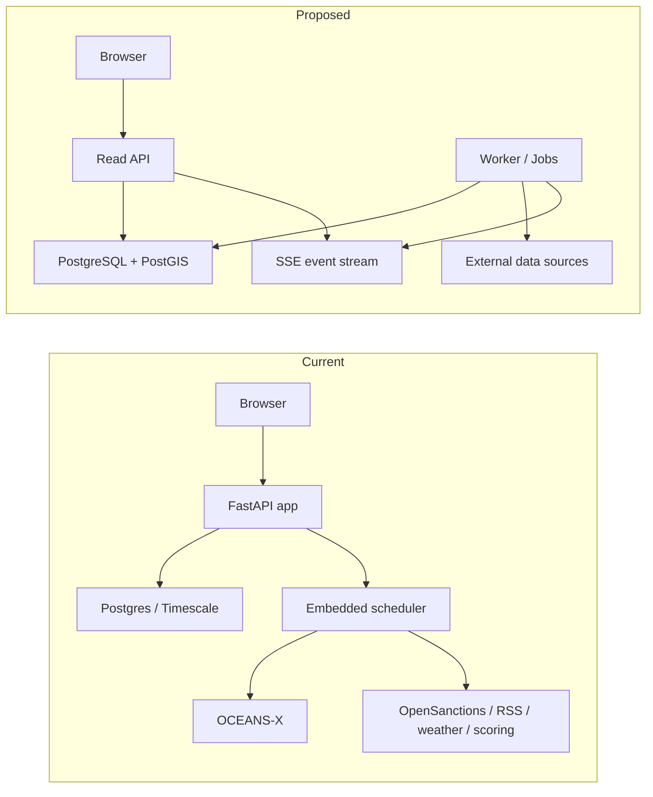
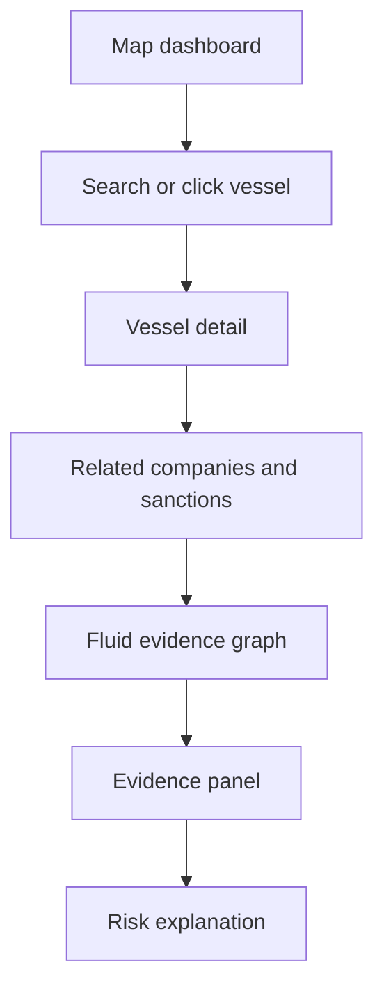
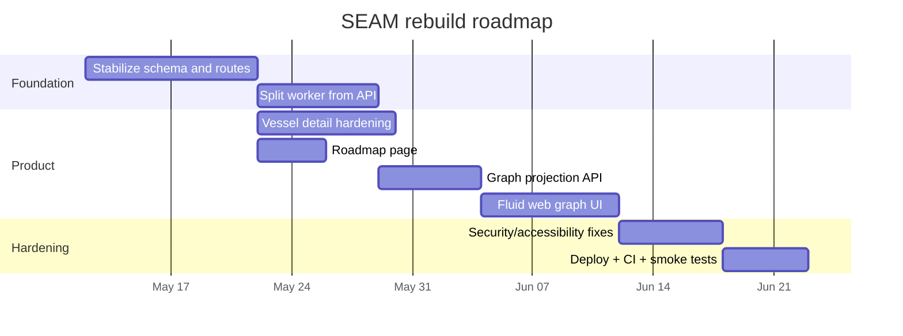
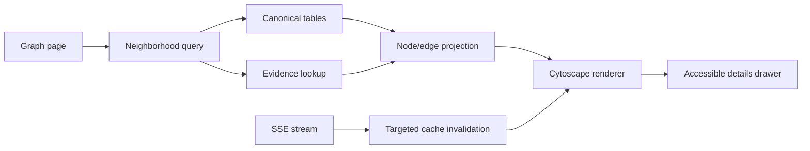

# SEAM Rebuild Research Report

## Executive Summary

The strongest conclusion from your materials is that SEAM already has a compelling *product direction* but an unstable *implementation direction*. The uploaded PRD and technical plan define SEAM as a backend-first, evidence-driven maritime intelligence product centered on entity["country","Singapore","city-state in Southeast Asia"], with maritime analysts as the primary user, OCEANS-X as the anchor data source, a map-first main page, and a relationship graph that helps explain vessel risk through ownership, sanctions, and operational context. fileciteturn4file0 fileciteturn4file1 citeturn21view1

The current implementation in urlSEAM on GitHubturn0view0 has already grown into a much broader system than the original Version 1 intent: the backend initializes a scheduler inside the API app lifecycle, registers many routers across vessels, history, geospatial, ports, macro, news, sanctions, search, risk, about, journal, and admin, and defines a very large data model spanning vessel identity, positions, companies, sanctions, review queues, and risk scoring. That breadth explains why the project feels “cobbled together”: the codebase is trying to do product, ingest, orchestration, analytics, and admin all at once. citeturn6view0turn12view0turn10view1turn6view3turn7view0turn7view1turn7view3turn7view4

The most important change I recommend is a **scope compression plus architecture separation**. Keep the current core domain objects, but split the system into three clearer layers: an API/UI layer for read-heavy analyst workflows, a worker layer for scheduled ingestion and enrichments, and an evidence layer in the database that stores only canonical records plus explainable provenance. That lets you preserve the ambition of the product without preserving the instability of the implementation. fileciteturn4file0 fileciteturn4file1 citeturn6view2turn12view0turn23view1turn23view0

For the roadmap page, the best direction is **not** to copy the uploaded sample, but to keep its strongest ideas: a dark “glass” visual system, track filters, visible definition-of-done criteria, progress indicators, and a timeline that tells the story of the rebuild. For the “fluid web” database visualization, the right production design is a **safe graph projection**, not a literal database dump: users should explore a curated network of vessels, companies, sanctions entities, ports, and evidence links, with neighborhood expansion, filters, search, and real-time deltas. The uploaded HTML inspiration is useful because it already demonstrates the interaction vocabulary you want: drag, zoom, search, reflow, focus, and side-panel inspection. fileciteturn4file2 fileciteturn0file3

My recommended stack is: urlFastAPIturn14search0, urlSQLAlchemyturn18search6, urlAlembicturn23view3, urlPostgreSQLturn23view0 + urlPostGISturn23view1, React + TypeScript with urlViteturn20search9 and urlTanStack Queryturn17search14, urlMapLibre GL JSturn21view3 + urldeck.glturn21view6 for geospatial views, and urlCytoscape.jsturn14search3 for the fluid evidence/database graph. I would keep urlReact Flowturn21view4 for curated node-based pages only, not as the primary “fluid web” graph engine. citeturn21view3turn23view6turn24view1turn21view4turn23view5

## Current-State Diagnosis

The product intent is clearer than the software boundaries. Your PRD and technical plan repeatedly point toward a stable progression: start with OCEANS-X ingestion, build canonical vessel and position records, layer relationship intelligence, then expose it through a map, graph, and analyst tooling. The existing repository goes further much earlier, which increases failure modes before the core foundation is fully hardened. fileciteturn4file0 fileciteturn4file1 citeturn21view1turn6view0turn12view0

A concrete sign of this is orchestration coupling. In the current backend, the scheduler is started during the FastAPI lifespan, and the scheduler file defines many recurring jobs: live position polling, particulars enrichment, macro refresh, news refresh and extraction, OpenSanctions refresh, shadow-fleet flags, weather pulls, dwell computation, hourly risk scoring, journal indexing, and dependency auditing. That architecture is convenient for a single local process, but it becomes fragile when you deploy more than one API instance, because each instance would attempt to start the same scheduler unless you add singleton controls. That is not a “small bug”; it is an application-boundary problem. citeturn6view1turn6view2turn12view0

The second structural issue is model sprawl. The backend already stores canonical vessels, live and archived positions, company relationships, sanctions matches, review queues, and risk scores, which is good domain groundwork. But the breadth is currently concentrated into a large central model file, which is harder to reason about, test, and change safely than a domain-partitioned schema package. The project has enough real complexity now that “one big models file” and “one API process that also runs cron-like jobs” are both holding back maintainability. citeturn5view2turn6view3turn7view0turn7view1turn7view3turn7view4

The frontend also shows an architectural gap between what exists and what the product needs next. The current app uses React route-level lazy loading and exposes only three main surfaces: `/`, `/admin/*`, and `/vessels/:imo`. Its package dependencies show a map/dashboard orientation built around Leaflet, charts, motion, and client-side state, but there is no dedicated roadmap route and no dedicated graph/network library for the interactive evidence or schema visualization you want to add. In other words, the route shell and code-splitting pattern are already useful, but the information architecture is still too narrow for the next stage. citeturn6view5turn5view0turn24view6turn24view7

Secrets and deployment also need simplification. The config layer includes provider keys, an encryption key, and an admin token bootstrap path, while the checked-in `docker-compose.yml` only defines the database service. That means a lot of the “full stack startup” logic appears to live outside a clean production deployment topology. For a portfolio project this is survivable; for a stable rebuild it is a maintenance trap, especially once scheduler, secrets, and admin tooling are in the same runtime. citeturn11view0turn3view3turn22view7turn26search2

What should be preserved is just as important as what should change. The repo already has a useful domain center of gravity: vessels, positions, companies, sanctions, analyst review, and risk snapshots. It also already uses asynchronous Python patterns and route-level lazy loading in the frontend, both of which are worth keeping. The rebuild should therefore be a **controlled pruning and re-layering**, not a total rewrite. citeturn14search8turn6view5turn7view0turn7view1turn7view3turn7view4



The diagram above reflects the central recommendation: move scheduled work out of the request-serving process, keep the read API boring and dependable, and let the database remain the evidence source of truth. That gives you a much better path to scale, testability, and reproducible deployments. citeturn6view2turn12view0turn23view1turn22view0turn27search0

## Improved Project Specification

Because the prompt left goals, user priorities, and stack preferences unspecified, the most defensible baseline is the combination of your PRD, technical plan, and current repository. Those sources consistently imply that SEAM should be a maritime intelligence application for analyst-style exploration of vessel identity, movement, ownership, sanctions risk, and supporting evidence around entity["country","Singapore","city-state in Southeast Asia"]. fileciteturn4file0 fileciteturn4file1 citeturn21view1

### Refined product definition

The improved Version 1 should answer four questions reliably:

1. **What is this vessel or maritime entity?**  
2. **Where is it, and what changed recently?**  
3. **Why is it considered low, medium, or high risk?**  
4. **What evidence supports that conclusion?**

That framing is tighter than the current codebase, but it still fits the original PRD vision of vessel intelligence, relationship context, analyzable evidence, and explainable outputs. fileciteturn4file0 fileciteturn4file1

### Recommended feature set

The first stable release should have five surface areas. The **Operations Map** is the primary landing page for active vessels and current context. The **Vessel Detail** page explains identity, movement history, related companies, sanctions signals, and risk components. The **Entity / Evidence Graph** page is the fluid network explorer. The **Roadmap** page explains progress and release planning. The **Admin / Dev** page is restricted to ingestion health, job control, source status, and review workflows. That decomposition keeps analyst workflows separate from maintainer workflows, which the current repo does not fully do yet. fileciteturn4file0 fileciteturn4file1 citeturn6view5turn10view1

### Revised data model

I recommend organizing the schema into **canonical**, **evidence**, **derived**, and **control** domains instead of treating every table as equal.

| Domain | Core tables | Why it exists |
|---|---|---|
| Canonical | `vessel`, `company`, `port`, `terminal`, `position_live`, `position_archive` | Stable analyst-facing truth |
| Relationship | `vessel_company_relationship`, `sanctions_entity`, `sanctions_match`, `news_entity_mention` | Connects core entities |
| Evidence | `source_observation`, `opensanctions_entity_raw`, `news_item`, `vessel_particular_fact` | Preserves provenance and explainability |
| Derived | `risk_score`, `anchorage_dwell`, `flag_performance_year` | Materialized analytics, recomputable |
| Control | `ingestion_job`, `ingestion_log`, `data_source_status`, `audit_log`, `agent_review_queue`, `api_source_config` | Operating the system safely |

This structure stays faithful to your existing model and technical plan, but it makes a crucial distinction: analyst pages should read mostly from canonical and derived tables, while provenance-facing inspectors and admin pages can drill into evidence and control tables. PostgreSQL’s `jsonb` and GIN indexing are a good fit for retaining raw or semi-structured source payloads, while PostGIS should remain the spatial backbone. fileciteturn4file0 fileciteturn4file1 citeturn23view0turn23view1turn7view0turn7view1turn7view3turn7view4

### Recommended API surface

The improved API should be versioned and explicitly split between public read paths and admin control paths.

**Public read API**
- `GET /api/v1/healthz`
- `GET /api/v1/map/viewport?bbox=...&zoom=...`
- `GET /api/v1/vessels?query=...&cursor=...`
- `GET /api/v1/vessels/{imo}`
- `GET /api/v1/vessels/{imo}/positions?from=...&to=...`
- `GET /api/v1/vessels/{imo}/relationships`
- `GET /api/v1/entities/{entityId}`
- `GET /api/v1/entities/{entityId}/neighbors?depth=1`
- `GET /api/v1/graph/schema?domain=...`
- `GET /api/v1/graph/neighborhood?id=...&mode=evidence`
- `GET /api/v1/stream/events` (SSE)

**Admin / control API**
- `GET /api/v1/admin/jobs`
- `POST /api/v1/admin/jobs/positions-snapshot`
- `POST /api/v1/admin/jobs/enrich-vessel`
- `GET /api/v1/admin/source-health`
- `POST /api/v1/admin/reviews/{reviewId}/resolve`
- `GET /api/v1/admin/audit-log`

This is intentionally less sprawling than the current router set, while still giving you room to map the existing backend modules into cleaner product-facing boundaries. FastAPI already supports a clean OpenAPI-first API surface for HTTP routes; use that for everything except the real-time event channel. citeturn6view0turn14search23turn14search0

### UI and UX flows

The main analyst journey should be simple: land on the map, search a vessel, open detail, inspect linked entities, expand the evidence graph, and finally open the supporting news or sanctions explanation. The supporting interfaces should not force users through admin concepts like jobs, slots, source keys, or ingestion logs unless they are explicitly in the admin area. fileciteturn4file0 fileciteturn4file1



The dev flow is separate: open admin, inspect source health, trigger a job, review logs, and approve or reject uncertain matches. That distinction aligns with the current admin/admin-review data model but presents it as an operational console instead of a general product surface. citeturn7view3turn22view7

## Custom Roadmap Page

The uploaded roadmap inspiration already points to the right visual language: glass panels, big milestone cards, metric blocks, progress bars, track filters, and staggered reveal motion. The page should borrow those principles, not the exact markup. In particular, your production roadmap page needs stronger deep-linking, release clarity, accessibility semantics, and reduced-motion behavior than the sample demo provides. fileciteturn4file2 citeturn22view6turn25search0

### Page structure

I recommend this content order:

1. **Hero** — what SEAM is, what release is current, and what is shipping next.  
2. **Release health strip** — completion %, blockers, target window, risk level.  
3. **Track filters** — Core Data, Graph, Map, Admin, AI, Polish.  
4. **Timeline** — milestone view across releases.  
5. **Current milestone cards** — each with scope, dependencies, and “done means.”  
6. **Architectural decisions** — links to ADRs and why key choices changed.  
7. **Risk register** — what could slip and how you are mitigating it.  
8. **Recent changes** — changelog summaries from shipped work.

That structure turns the roadmap into a public-facing project intelligence page instead of a decorative status board. It also matches the original docs, which already emphasize milestones, build order, known risks, and definition of done. fileciteturn4file1

### Wireframe

```text
┌───────────────────────────────────────────────────────────────┐
│ HERO                                                         │
│ SEAM Rebuild · Current Release · Next Milestone · CTA        │
├───────────────────────────────────────────────────────────────┤
│ Health cards: completion | blockers | stability | next ship  │
├───────────────────────────────────────────────────────────────┤
│ Filters: All | Core Data | Graph | Map | Admin | AI | Polish │
├───────────────────────────────────────────────────────────────┤
│ TIMELINE / GANTT                                              │
├───────────────────────────────┬───────────────────────────────┤
│ Milestone card                │ Milestone card                │
│ Goal                          │ Goal                          │
│ Tasks                         │ Tasks                         │
│ Dependencies                  │ Dependencies                  │
│ Done when                     │ Done when                     │
├───────────────────────────────┴───────────────────────────────┤
│ ADR highlights / risk register / release notes               │
└───────────────────────────────────────────────────────────────┘
```

### Interaction patterns

The roadmap should support keyboard-driven filtering, visible focus styles, hover-independent disclosure, and sharable deep links to milestone cards such as `/roadmap#milestone-graph-v1`. Animations should be optional, not required: presence transitions are fine, but no critical information should depend on scrolling effects or delayed reveal. Use `prefers-reduced-motion` to cut non-essential movement, and use semantic headings and buttons so the page remains navigable without the visual treatment. citeturn25search0turn22view6turn25search1

### Timeline proposal



This timeline is realistic for a solo rebuild if you treat the roadmap page as a small but polished parallel track, not as a blocker to backend stabilization. It also communicates progress in a way that recruiters, interviewers, and technical reviewers can understand instantly. fileciteturn4file0 fileciteturn4file1

## Fluid Web Database Visualization

The second HTML example is useful because it expresses the exact interaction model you want: a force-like network on a canvas, graph search, domain filters, smooth zoom, reflow, a right-hand inspector, and node-centered focus. The main improvement needed is conceptual, not visual: the production version should visualize a **curated graph projection** of SEAM’s domain model and evidence links, not a raw ORM schema or unrestricted database topology. fileciteturn0file3 citeturn7view0turn7view1turn7view3turn7view4

### Recommended design

For this specific “fluid web” view, I recommend **urlCytoscape.jsturn14search3 as the primary graph engine**, used inside your React app. The reason is fit: Cytoscape.js is designed for interactive network visualization and graph analysis, supports zoom/pan/selection out of the box, and is a better match for variable network exploration than a node-editor library. Keep **urlReact Flowturn21view4** for deterministic diagrams such as workflow pages or curated dependency editors, and reserve **urlSigma.jsturn21view5** as a fallback renderer if you later need read-only views with thousands of nodes. citeturn24view1turn21view4turn21view5turn24view2

### Graph modes

The graph page should support three modes:

- **Schema mode** — high-level table/domain view, useful for debugging architecture and onboarding.  
- **Evidence mode** — vessels, companies, sanctions entities, ports, news, and observations.  
- **Neighborhood mode** — start from one node and expand 1-hop or 2-hop connections on demand.

The user should never load the full graph by default. Load a focused neighborhood first, then let the user expand. That is the single most important performance choice for this feature. For supporting geographic context, continue to use MapLibre and deck.gl on the map pages rather than trying to force everything into one graph surface. citeturn23view7turn21view6turn23view6

### Interaction requirements

The graph page should include:

- search by IMO, entity name, company, sanctions entity, or port;
- domain filters;
- zoom and pan;
- “reflow” and “freeze layout” controls;
- node pinning;
- a details drawer;
- evidence chips;
- edge labels on focus;
- neighborhood expansion;
- selection breadcrumbs;
- mini-map or overview count;
- export as PNG/JSON.

That interaction set takes the spirit of your sample and turns it into a product-ready analyst tool. The side panel should always be the textual explanation layer, so the graph remains fast while the details stay accessible and inspectable. fileciteturn0file3 citeturn24view1turn25search2turn25search6

### Real-time updates and lazy loading

Use **SSE first, WebSockets later**. The graph page mostly needs one-way notifications such as “risk score updated,” “new sanctions match,” “new position ingested,” or “job completed.” SSE is well suited to server-to-client push over HTTP, while WebSockets are better only if you later add collaborative graph editing, multi-user review queues, or bidirectional controls. In the frontend, consume the event stream, update targeted caches, and invalidate only affected graph neighborhoods via TanStack Query. citeturn24view3turn19search2turn24view4turn24view5

### Data contract

A good Graph API contract looks like this:

```json
{
  "nodes": [
    {
      "id": "vessel:9319466",
      "kind": "vessel",
      "label": "PACIFIC EXPLORER",
      "domain": "canonical",
      "risk": 0.74,
      "summary": "Singapore-flagged tanker with ownership and sanctions context",
      "metrics": { "degree": 6, "updatedAt": "2026-05-08T12:10:00Z" }
    }
  ],
  "edges": [
    {
      "id": "e1",
      "source": "vessel:9319466",
      "target": "company:4421",
      "kind": "operated_by",
      "confidence": 0.92,
      "evidenceCount": 3
    }
  ],
  "pageInfo": {
    "expansionDepth": 1,
    "canExpand": true,
    "nextCursor": "..."
  }
}
```

Use separate fields for `kind`, `domain`, `confidence`, and `evidenceCount`; that makes filtering and styling cheap on the client. Avoid shipping raw payloads in graph responses. Instead, attach evidence IDs and let the drawer fetch detailed records on demand. That is both more secure and more maintainable. citeturn22view7turn26search21turn26search2

### Performance and accessibility requirements

For performance, use neighborhood loading, memoized selectors, and route-level lazy loading so the graph bundle only loads when the page is opened. If you later use a React wrapper, avoid broad subscriptions that re-read the entire node/edge set on every drag or zoom. For accessibility, do **not** rely on the canvas/graph alone: provide a synchronized details panel, keyboard traversal, live announcements for selection changes, and fallback textual summaries or lists for users who cannot use the visual graph effectively. citeturn23view5turn24view6turn24view7turn25search2turn25search3turn25search7



## Stack Options and Recommendation

### Application stack options

| Option | Fit for SEAM | Main upside | Main downside |
|---|---|---|---|
| urlReact + Viteturn20search9 + urlFastAPIturn14search0 + urlPostgreSQLturn23view0/urlPostGISturn23view1 | **Best fit** | Matches current repo, fast local iteration, clear SPA routing | You must own auth, SEO, and app shell conventions yourself |
| urlNext.jsturn20search12 + urlFastAPIturn14search0 + urlPostgreSQLturn23view0/urlPostGISturn23view1 | Good if roadmap becomes public marketing surface | Better hybrid rendering and public-facing pages | Adds framework complexity without solving backend instability |
| Next.js full-stack + TypeScript backend | Possible, but not ideal now | One language everywhere | Rebuild cost is too high relative to your current codebase |

The recommendation is to stay with the current broad shape—React SPA plus FastAPI API—but to cleanly separate the worker process and harden the domain boundaries. Vite remains a strong fit because it aligns with your existing app and supports code splitting via dynamic import. FastAPI remains a strong fit because the product is API-centric and benefits from typed route definitions and automatic OpenAPI generation. citeturn22view5turn24view6turn24view7turn14search23turn14search8

### Visualization library options

| Library | Best use in SEAM | Strength | Limitation |
|---|---|---|---|
| urlCytoscape.jsturn14search3 | **Primary fluid graph** | Network-native interactions and graph analysis | Styling is powerful but can become complex |
| urlReact Flowturn21view4 | Curated editors, DAGs, roadmap dependency views | Excellent custom-node UI and React ergonomics | Not the best fit for organic analyst graph exploration |
| urlSigma.jsturn21view5 | Large read-only overview graphs | WebGL renderer aimed at thousands of nodes | Less ergonomic for rich custom node UX |
| urlD3-forceturn15search1 | Bespoke prototypes and custom physics | Maximum flexibility | You own most interaction, rendering, and maintenance |
| urlMapLibre GL JSturn21view3 + urldeck.glturn21view6 | Geospatial map surfaces | WebGL vector maps, large-data overlays, MapLibre integration | Not a substitute for a relationship graph engine |

The best combination for SEAM is **MapLibre + deck.gl for maps** and **Cytoscape.js for the fluid evidence/database web**. Keep React Flow available, but only where the UI is intentionally diagrammatic and editor-like. That split gives each library a job that matches its design center. citeturn23view6turn24view1turn21view5turn24view0

### Hosting and deployment options

| Platform | Best use | Strength | Trade-off |
|---|---|---|---|
| urlRenderturn27search9 | **Recommended MVP hosting** | Native web service + background worker + managed Postgres | Less low-level control than VM-style hosting |
| urlRailwayturn27search30 | Fast prototypes | Easy Postgres and cron setup | Better for simple service topologies than more opinionated production setups |
| urlFly.ioturn16search30 | Region-aware, hands-on deployments | Strong control and scale-to-zero patterns | More ops responsibility |
| urlCloud Runturn27search12 | Later-stage scale and scheduled jobs | Autoscaling services and run-to-completion jobs | More cloud configuration overhead |

For the first stable rebuild, I would deploy the frontend and API as separate services on Render, move scheduled ingestion into a Render background worker, and attach managed Postgres there. Render’s docs explicitly frame workers as the place for long-running asynchronous tasks, which is a cleaner fit than embedding the scheduler in your web process. If you later want more autoscaling and scheduled job control, Cloud Run becomes a strong second-stage option. citeturn22view0turn27search1turn21view7turn27search0

## Delivery Plan, Code Examples, and Checklists

### Implementation roadmap and estimated effort

A realistic solo rebuild is **6 to 8 weeks at roughly 15 to 20 focused hours per week**, or **4 to 5 weeks full-time**. The crucial point is sequencing: stabilize the core first, then add the attractive surfaces. That order is already implied by your uploaded technical plan and should be enforced much more strictly in the rebuild. fileciteturn4file1

| Milestone | Scope | Estimated effort | Exit criteria |
|---|---|---:|---|
| Core stabilization | prune routes, split schema domains, remove dead paths | 1.0–1.5 weeks | API boots cleanly, migrations pass, smoke tests green |
| Worker separation | move scheduler/jobs into dedicated worker | 1 week | API can scale independently without duplicate jobs |
| Canonical read API | vessel, entity, map, graph neighborhood endpoints | 1 week | analyst flows work without admin routes |
| Roadmap page | `/roadmap` route, timeline, filters, changelog, risk view | 0.5 week | page is keyboard-accessible and reduced-motion-safe |
| Fluid graph page | Cytoscape graph + search + lazy expansion + SSE | 1–1.5 weeks | graph remains responsive on realistic seeded data |
| Hardening and deploy | CI, accessibility audit, security pass, hosting | 1 week | staging deploy, smoke tests, review checklist complete |

### Testing plan

The testing strategy should be **layered**. Unit tests cover matching logic, graph projection, risk computation, and API serializers. Integration tests cover OCEANS-X ingest transforms, database migrations, and neighborhood graph queries against a seeded Postgres instance. End-to-end tests cover the map flow, vessel detail flow, graph flow, and roadmap page behavior. CI should run on every pull request using urlGitHub Actionsturn27search3. The backend test story already exists in nascent form in the repo, where the backend test folder lists five test files; the rebuild should expand that foundation rather than abandon it. citeturn27search3turn3view0turn5view0

### Code examples and integration notes

The route additions below follow your *existing* lazy-loaded `App.tsx` pattern, which is a good foundation to keep. React’s `lazy()` plus Suspense and Vite’s code-splitting behavior make this a clean way to add `/roadmap` and `/graph` without bloating the initial bundle. citeturn6view5turn24view7turn24view6

```tsx
// frontend/src/App.tsx
import { lazy, Suspense } from "react";
import { Routes, Route, Navigate } from "react-router-dom";

const LiveMap = lazy(() => import("./pages/LiveMap"));
const VesselDetail = lazy(() => import("./pages/VesselDetail"));
const AdminApp = lazy(() => import("./pages/admin/AdminApp"));
const RoadmapPage = lazy(() => import("./pages/RoadmapPage"));
const GraphPage = lazy(() => import("./pages/GraphPage"));

function Loading() {
  return <div className="min-h-screen grid place-items-center">Loading…</div>;
}

export default function App() {
  return (
    <Suspense fallback={<Loading />}>
      <Routes>
        <Route path="/" element={<LiveMap />} />
        <Route path="/vessels/:imo" element={<VesselDetail />} />
        <Route path="/graph" element={<GraphPage />} />
        <Route path="/roadmap" element={<RoadmapPage />} />
        <Route path="/admin/*" element={<AdminApp />} />
        <Route path="*" element={<Navigate to="/" replace />} />
      </Routes>
    </Suspense>
  );
}
```

For the roadmap page, the most important implementation note is accessibility, not animation. Use semantic sections, real buttons for filters, visible focus, and reduced-motion fallbacks. The snippet below shows the right baseline structure rather than a final visual design. citeturn25search0turn22view6

```html
<section class="roadmap-hero" aria-labelledby="roadmap-title">
  <p class="eyebrow">SEAM rebuild</p>
  <h1 id="roadmap-title">What is shipping, what is blocked, and what comes next</h1>
  <p class="lede">
    A transparent build log for the analyst platform, graph engine, and deployment hardening work.
  </p>

  <nav aria-label="Roadmap track filters" class="track-filters">
    <button aria-pressed="true">All</button>
    <button aria-pressed="false">Core Data</button>
    <button aria-pressed="false">Graph</button>
    <button aria-pressed="false">Map</button>
    <button aria-pressed="false">Admin</button>
  </nav>
</section>
```

For the fluid web graph, use a safe projection endpoint and subscribe to SSE for targeted updates. The important pattern is that you do **not** refetch the entire graph on every event. Update or invalidate the affected neighborhood only. citeturn24view3turn24view5

```tsx
// frontend/src/features/graph/useGraphStream.ts
import { useEffect } from "react";
import { useQueryClient } from "@tanstack/react-query";

export function useGraphStream() {
  const qc = useQueryClient();

  useEffect(() => {
    const source = new EventSource("/api/v1/stream/events");

    source.addEventListener("graph_delta", (event) => {
      const delta = JSON.parse((event as MessageEvent).data);
      qc.invalidateQueries({ queryKey: ["graph", "neighborhood", delta.anchorId] });
    });

    source.addEventListener("risk_updated", (event) => {
      const payload = JSON.parse((event as MessageEvent).data);
      qc.invalidateQueries({ queryKey: ["vessel", payload.imo] });
      qc.invalidateQueries({ queryKey: ["graph"] });
    });

    return () => source.close();
  }, [qc]);
}
```

For the backend, the graph endpoint should act like a projection service rather than a domain dump. The pseudocode below illustrates the correct boundary. citeturn14search0turn18search2turn18search18

```python
# backend/app/routers/graph.py
@router.get("/api/v1/graph/neighborhood")
async def get_neighborhood(
    id: str,
    depth: int = 1,
    mode: str = "evidence",
    session: AsyncSession = Depends(get_session),
):
    anchor = await graph_service.resolve_anchor(session, id=id)
    if not anchor:
        raise HTTPException(status_code=404, detail="Anchor not found")

    nodes, edges, page_info = await graph_service.fetch_neighborhood(
        session=session,
        anchor=anchor,
        depth=min(depth, 2),
        mode=mode,
    )

    return {
        "nodes": [serialize_node(n) for n in nodes],
        "edges": [serialize_edge(e) for e in edges],
        "pageInfo": page_info,
    }


# backend/app/streams/events.py
async def publish_graph_delta(anchor_id: str, event_type: str):
    await sse_bus.publish(
        event="graph_delta",
        data={"anchorId": anchor_id, "eventType": event_type},
    )
```

### Security, privacy, and accessibility checklist

The checklist below is the minimum bar I would use before calling the rebuild “stable.”

**Security**
- Move scheduled jobs into a worker service; do not run them in every API instance. citeturn12view0turn22view0turn21view7
- Require role-based authorization on admin and review routes; prevent excessive data exposure and mass assignment style leaks. citeturn22view7
- Store secrets in platform secret management, not app-editable general settings where possible; rotate and audit access. citeturn26search2
- Enforce HTTPS and set HSTS on production domains. citeturn26search3turn26search15
- Add CI checks in GitHub Actions for tests, lint, type checks, and migration drift. citeturn27search3

**Privacy**
- Keep analyst graph responses free of raw provider payloads and secrets. Return IDs and summaries, not raw source blobs, by default. citeturn26search21turn26search0
- Apply data minimization and explicit retention windows to logs, review notes, and source observations. citeturn26search21turn26search5
- Document which third-party sources are used, what is cached, and how long it is kept. fileciteturn4file0
- Treat provider API keys and any analyst-entered notes as sensitive configuration data. citeturn11view0turn26search2

**Accessibility**
- Target WCAG 2.2 AA for all new pages. citeturn22view6
- Support keyboard access for all graph and roadmap interactions; do not make drag-only controls the only path. citeturn25search1turn25search5
- Use `aria-live` for graph selection changes, job completion toasts, and status updates. citeturn25search2turn25search6
- Respect `prefers-reduced-motion` on roadmap reveals and graph reflows. citeturn25search0
- Provide fallback text or an alternative representation for canvas-heavy views. citeturn25search3turn25search7

### Open questions and limitations

A few things remain inherently uncertain because they were not specified in the prompt and could change your implementation choices:

- whether SEAM is ultimately portfolio-first, internal-tool-first, or commercial-product-first;
- whether you need multi-user auth now or only an admin gate;
- whether OCEANS-X access is guaranteed and what usage limits apply in practice;
- whether the current Timescale-based path is worth keeping, or whether plain PostgreSQL partitioning is simpler for now;
- whether AI features should ship in V1 at all, or remain disabled until the evidence layer is fully trustworthy. fileciteturn4file0 fileciteturn4file1 citeturn18search1turn18search0

Even with those open questions, the highest-confidence recommendation is clear: **keep the product vision, shrink the runtime complexity, separate worker from API, add an explicit roadmap route, and build the fluid web graph as a curated evidence explorer rather than a raw schema toy.** That path fits the original design intent much better than continuing to expand the current all-in-one process architecture. fileciteturn4file0 fileciteturn4file1 citeturn6view0turn12view0turn6view5